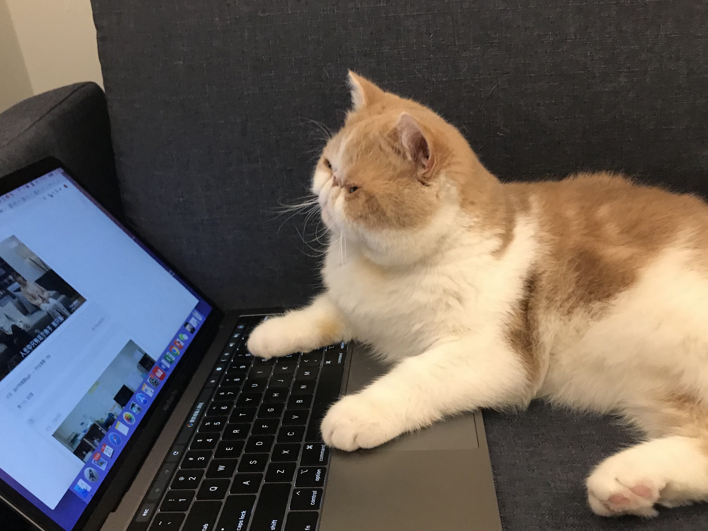

### 

Hi, I'm Xueting Zhang, currently a Health Informatics graduate student at Cornell University. I received my Bachelor degree in Biology at UC San Diego. 

Previously, I've workes as an e-commerce strategy intern at LVMH P&C, helping the group making digital tranformation strategies and communicating with top consulting companies to achieve the goal. 

At Scripps Research Institute, I participated in Dr. Makarenkova’s molecular biology research project, studying molecular mechanisms of lacrimal gland development and regeneration with a goal to develop new therapies to restore lacrimal gland function.

My resume is available [here](Files/Resume-Xueting.pdf).